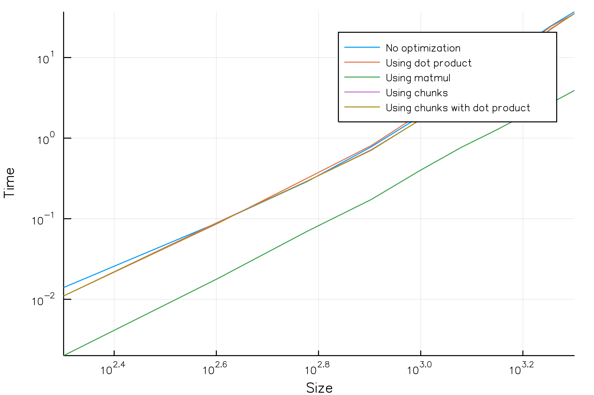

# Matrix-Multiplication
Testing optimization of matrix multiplication in fortran

### Requirements:
Fairly new version of `gfortran`
### Build:
Building without optimization:
```sh
make build
```
Building with optimization:
```sh
make build-opt
```
### Usage:
To perform automatized launch of application with redirected output, run:
```sh
make check-time
```
In order to run the application, open your terminal in main folder of the project and run the following line of code. 
```sh
./main <rows1> <col1> <rows2> <col2> <optimization mode> <output path>
```
### Running tests:
Before moving on to running test, at first you have to build program and remove main.o because of conflict with pFunit files.
Then you have to only run the following command:
```sh
make test
```
and then in order to check testing results:
```sh
./test
```

### Plots:
Plots have been generated using Julia language and Plots package. 

### Results:


